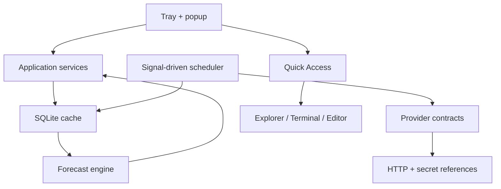

# Dev Status Center

Centro de estado personal, local-first y ligero para Windows. Vive en el System Tray y muestra en segundos consumo de IA, costos cloud, presupuestos, pagos próximos y accesos rápidos a proyectos sin mantener una ventana tradicional abierta.

## Estado actual

Este repositorio implementa **MVP 0** como una vertical funcional:

- aplicación WPF para Windows 10/11 sobre .NET 10;
- icono dinámico en el System Tray;
- popup compacto que primero lee SQLite;
- modos `Normal`, `Eco`, `Paused` y `Gaming`;
- scheduler dirigido por señales, sin polling de alta frecuencia;
- cancelación inmediata de refresh activos;
- contratos desacoplados para providers;
- `MockProvider` con IA, cuotas e infraestructura;
- snapshots normalizados de usage y billing;
- forecast variable + pagos fijos conocidos;
- fuentes y precisión visibles (`billed`, `estimated`, `manual`, `demo`);
- persistencia SQLite con WAL y migraciones incrementales;
- secretos protegidos con DPAPI y nunca guardados en SQLite;
- reintentos HTTP acotados, backoff, jitter, timeout y `Retry-After`;
- Quick Access jerárquico para grupos, carpetas y proyectos;
- apertura segura en Explorer, Windows Terminal o VS Code;
- opción **Start with Windows** mediante la clave Run del usuario actual;
- pruebas unitarias e integración y CI para Windows.

**Neon** ya está implementado (consumo oficial + costo calculado desde tarifas de lista,
marcado como estimación) y a la espera de verificarse contra la API real con un token. Vercel y
Cloudflare siguen deliberadamente desactivados. La arquitectura, transporte y secret store están listos para implementarlos después de proporcionar credenciales de solo lectura. No se incluyen endpoints inventados ni scraping frágil.

## Inicio rápido en Windows

Requisitos:

- Windows 10 2004+ o Windows 11;
- [.NET 10 SDK](https://dotnet.microsoft.com/download/dotnet/10.0);
- Visual Studio con el workload **.NET desktop development**, o solo terminal.

```powershell
git clone <URL-DEL-REPOSITORIO>
cd dev-status-center
dotnet restore DevStatusCenter.slnx --use-lock-file
dotnet build DevStatusCenter.slnx -c Release
dotnet run --project src/DevStatusCenter.Desktop/DevStatusCenter.Desktop.csproj
```

La aplicación inicia minimizada: busca el punto verde en el área de notificaciones. En la primera ejecución el `MockProvider` llena el caché después de unos milisegundos. El popup posterior se construye desde SQLite.

Para validar y publicar una build local:

```powershell
./scripts/verify.ps1
```

## Arquitectura en una imagen



Las dependencias apuntan hacia adentro:

```text
Desktop -> Infrastructure -> Application -> Domain
Desktop -> MockProvider ----> Application -> Domain
```

`Domain` y `Application` no conocen WPF, SQLite, Win32, DPAPI ni nombres concretos como Vercel.

## Estructura

| Ruta | Responsabilidad |
|---|---|
| `src/DevStatusCenter.Domain` | Entidades, value objects, monedas, precisión y estados |
| `src/DevStatusCenter.Application` | Contratos de provider, scheduler, power modes, dashboard y forecast |
| `src/DevStatusCenter.Infrastructure` | SQLite, DPAPI, HTTP resiliente y lanzadores Windows |
| `src/DevStatusCenter.Providers.Mock` | Datos deterministas para probar el pipeline completo |
| `src/DevStatusCenter.Desktop` | WPF, tray, popup, view models y editor de Quick Access |
| `tests/DevStatusCenter.Tests` | Pruebas unitarias e integración |
| `docs` | Contexto, requisitos, ADRs, seguridad, performance y continuación |
| `scripts` | Validación, publicación local y medición idle |

## Invariantes del producto

1. Abrir el popup nunca depende de una llamada de red.
2. Fallar un provider no invalida los datos de los demás.
3. Una API fallida no reemplaza el último valor válido por cero.
4. `Paused` y `Gaming` cancelan timers y requests activos.
5. Las cifras conservan moneda, fuente y precisión.
6. Las credenciales reales no viven en archivos JSON ni SQLite.
7. No existen timers por segundo, WebView, Chromium ni loops activos.
8. Quick Access no indexa ni vigila carpetas en background.

## Documentación para continuar

- [Contexto y límites](docs/PROJECT_CONTEXT.md)
- [Requisitos y criterios de aceptación](docs/REQUIREMENTS.md)
- [Arquitectura](docs/ARCHITECTURE.md)
- [Modelo de datos](docs/DATA_MODEL.md)
- [Guía de providers](docs/PROVIDER_GUIDE.md)
- [Conexiones pendientes](docs/CONNECTIONS_TODO.md)
- [Quick Access](docs/QUICK_ACCESS.md)
- [Seguridad](docs/SECURITY.md)
- [Performance](docs/PERFORMANCE.md)
- [Setup y solución de problemas](docs/SETUP_WINDOWS.md)
- [Roadmap](docs/ROADMAP.md)

## Qué sigue

La siguiente vertical debe ser **un solo provider real** de extremo a extremo. Neon es el candidato recomendado porque facilita validar cuenta → proyectos → métricas → snapshots → forecast. La regla es terminar autenticación, errores, rate limit, precisión y UI de Neon antes de duplicar código para Vercel o Cloudflare.

Consulta [CONTRIBUTING.md](CONTRIBUTING.md) antes de modificar contratos o migraciones.
