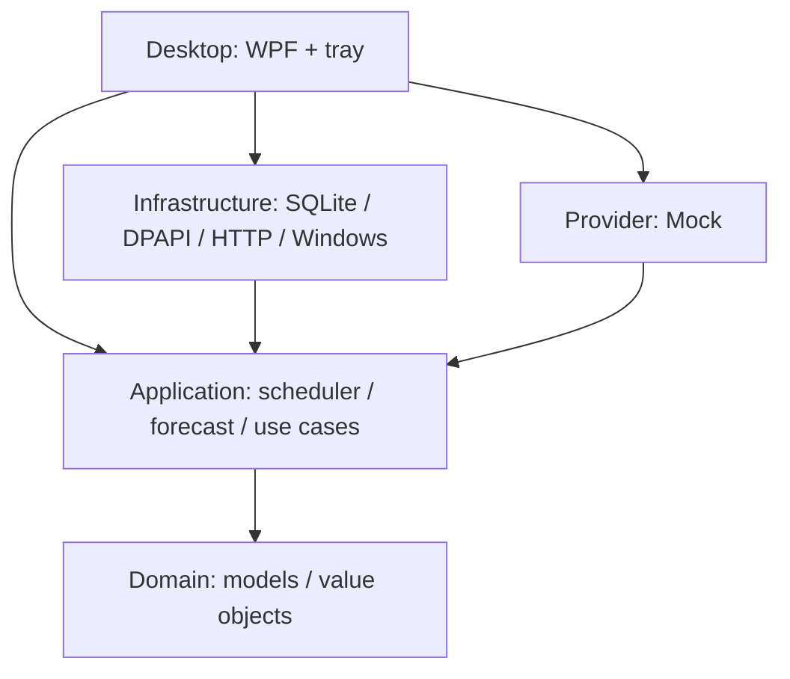
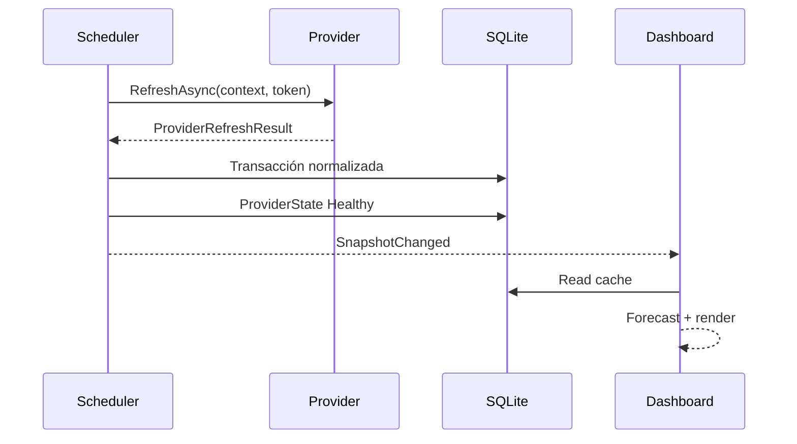
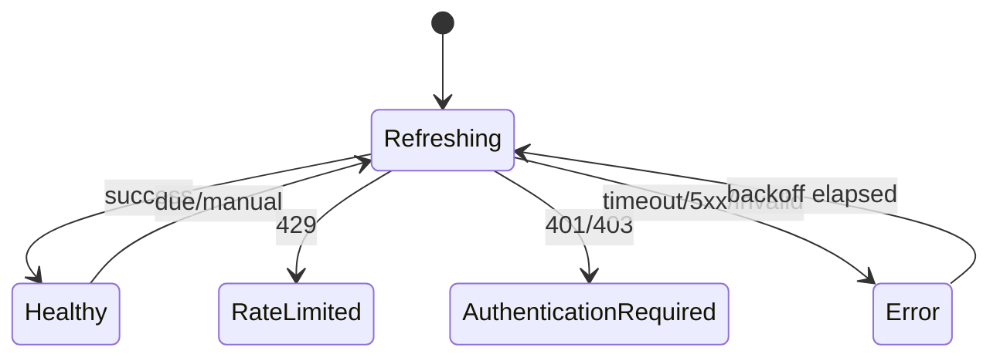

# Arquitectura

## Capas

La composición es manual en `App.xaml.cs`. No se incorpora un host ni un contenedor de dependency injection porque el grafo actual es pequeño y estable. Si la composición supera aproximadamente 30 servicios con lifetimes complejos, se reevalúa mediante ADR.

## Pipeline de refresh

La UI jamás llama directamente al provider. La notificación `SnapshotChanged` solo indica que debe releer el caché; no transporta objetos externos ni mantiene referencias a respuestas HTTP.

## Scheduler

`RefreshScheduler` tiene un único lector de comandos y permanece suspendido sobre:

- `Channel.WaitToReadAsync` cuando espera una acción;
- `Task.Delay` hasta el siguiente vencimiento;
- tareas HTTP cuando un provider realmente debe refrescarse.

No hay `while(true)` activo: el loop solo se despierta por comando, vencimiento o cancelación. `Paused` y `Gaming` cancelan el `CancellationTokenSource` del ciclo actual. Normal/Eco vuelven a poner providers como due.

La concurrencia está acotada por `SemaphoreSlim` (3 de forma predeterminada), además de `MaxConnectionsPerServer = 4` en HTTP.

## Estado y fallos

Cada provider mantiene:

- último intento;
- último éxito;
- próximo refresh;
- fallos consecutivos;
- código/mensaje sanitizado;
- estado visible.

## Lecturas y escrituras

SQLite usa una conexión corta por operación, pooling, shared cache, WAL y `synchronous=NORMAL`. Un semáforo serializa escrituras dentro del proceso. Cada refresh se aplica en una sola transacción. Las lecturas del popup son consultas locales indexadas.

## Forecast

El motor recibe solo datos normalizados en una moneda de display. Una capa futura de FX deberá crear importes convertidos con timestamp y fuente; el forecast no puede improvisar un tipo de cambio.

Modelo inicial:

\[
P_{variable}=\max\left(C,\frac{C}{d_{elapsed}}d_{period}\right)
\]

\[
P_{total}=P_{variable}+S_{fixed}+P_{unlinked}+C_{fixed\ services}
\]

Los pagos enlazados a una suscripción se omiten de `P_unlinked` para evitar doble conteo.

## Quick Access

Quick Access es una capacidad paralela, no un provider. Sus entradas forman un adjacency list mediante `parent_id`. Solo se toca filesystem al guardar/abrir una ruta; no existe watcher ni indexación.

## Extensibilidad

Agregar un provider requiere:

1. proyecto `DevStatusCenter.Providers.<Name>`;
2. implementación de `IProvider` y capacidades opcionales;
3. modelos DTO internos no compartidos;
4. mapper a `ServiceObservation`;
5. registro en la composition root;
6. fixtures y pruebas.

El núcleo no debe contener `if (provider == "vercel")`.

