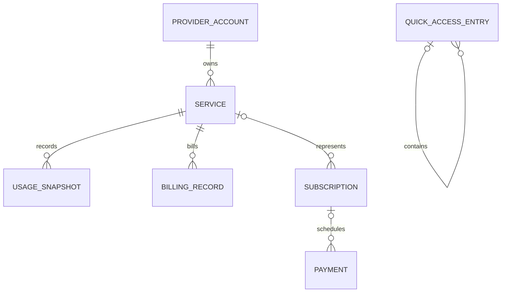

# Modelo de datos

## Agregados de dominio

| Modelo | Propósito |
|---|---|
| `Service` | Recurso normalizado visible y atribuible a una cuenta |
| `ProviderAccount` | Cuenta personal/empresa y referencia lógica de credencial |
| `UsageMetric` | Definición de una medida: tokens, compute, storage, etc. |
| `UsageSnapshot` | Valor acumulado en un instante y periodo |
| `BillingRecord` | Importe reportado/calculado para un servicio y periodo |
| `Subscription` | Obligación recurrente fija |
| `Payment` | Evento de pago concreto, enlazado opcionalmente a suscripción |
| `Budget` | Límite global, por categoría o servicio |
| `ProviderState` | Salud y agenda del provider |
| `RefreshPolicy` | Intervalos mínimo, normal y eco |
| `QuickAccessEntry` | Grupo, carpeta o proyecto jerárquico |

## Relaciones



## Identidades

Los IDs internos son strings estables y namespaced. Ejemplo:

```text
vercel:personal:project_abc
neon:company:project_xyz
mock:mock-personal:openai
```

Un snapshot usa ID determinista cuando el provider entrega un ID externo. Si no, combina servicio, métrica y timestamp. `ON CONFLICT DO NOTHING` hace idempotente una repetición.

## Dinero

`Money` contiene `decimal Amount` + código ISO 4217. SQLite persiste el decimal como `TEXT` invariant para no introducir error binario de `REAL`. No se suman monedas distintas.

Una futura conversión debe almacenar:

- monto original;
- moneda original;
- monto convertido;
- moneda de display;
- tasa;
- timestamp y fuente de la tasa.

## Tiempo

Instantes se normalizan a Unix milliseconds UTC. `BillingPeriod` conserva también `TimeZoneId` para reconstruir límites del proveedor. Presentación usa la zona local del usuario.

## Fuente y precisión

Fuente:

1. `OfficialBillingApi`
2. `OfficialUsageApi`
3. `Invoice`
4. `Manual`
5. `Mock`

Precisión:

- `Exact`
- `ProviderReported`
- `Calculated`
- `Estimated`
- `Manual`
- `Stale`

Fuente describe procedencia; precisión describe confianza. No son intercambiables.

## Migraciones

Los scripts viven en `Infrastructure/Persistence/Migrations`, se embeben en el assembly y se aplican en orden lexicográfico. Nunca se edita una migración ya liberada; se agrega la siguiente. Toda migración debe:

- ser transaccional;
- preservar datos;
- crear índices explícitos para nuevas lecturas;
- tener prueba de upgrade cuando exista una release pública.

